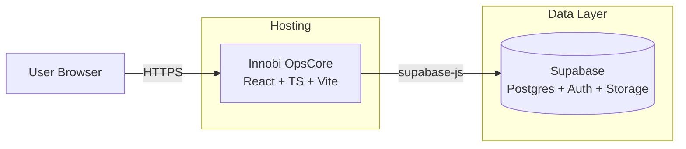

# Innobi OpsCore

Premium neon-glass ERP dashboard built with **React**, **TypeScript**, **Vite**, **Tailwind**, and **Supabase**.  
Designed and developed by **Innobi (Salih Sezen)** as a modern ERP UX & analytics showcase.

[🌐 Live Site](https://opscore.innobi.site) • [🏷 Innobi Portfolio](https://innobi.site)

---

## Table of Contents

- [Overview](#overview)
- [Features](#features)
  - [Core ERP Modules](#core-erp-modules)
  - [UX & Design](#ux--design)
  - [Data & Analytics](#data--analytics)
- [Tech Stack](#tech-stack)
- [Architecture Overview](#architecture-overview)
- [Screenshots](#screenshots)
- [Project Structure](#project-structure)
- [Getting Started](#getting-started)
  - [Prerequisites](#prerequisites)
  - [Installation](#installation)
  - [Environment Variables](#environment-variables)
  - [NPM Scripts](#npm-scripts)
- [Supabase & Types](#supabase--types)
- [Roadmap](#roadmap)
- [Author / Contact](#author--contact)

---

## Overview

Innobi OpsCore is a **frontend-first ERP experience** focused on clean information architecture, executive-friendly KPIs, and a neon-glass UI that works in both light and dark themes.  

It includes classic ERP entities (Customers, Projects, Vendors, Employees, Purchase Orders, Invoices) and a dashboard layer for revenue tracking and operational health — all wired to a Supabase backend via a type-safe client.

The project is ideal as:

- A **portfolio-grade** React + TypeScript codebase,
- A **starting point** for internal tools / ERP-style admin panels,
- A **UX reference** for neon-glass / neumorphic dashboards.

---

## Features

### Core ERP Modules

- **Dashboard**
  - High-level KPIs (revenue, projects, utilization, etc.).
  - Time-series charts (e.g., monthly revenue / trends) built with Recharts.
  - Status breakdowns (e.g., by project / PO / invoice state).

- **Customers**
  - Customer directory with tabular view.
  - Detail-first layout ready for activity, open projects, and AR exposure.

- **Projects**
  - Project list with status indicators (Active, On Hold, Completed).
  - Hooks prepared for linking to Customers, POs, and Invoices.

- **Vendors**
  - Vendor registry to support purchasing workflows.

- **Employees**
  - Employee list ready for role, department, and utilization metrics.

- **Purchase Orders**
  - PO table with status (Draft / Ordered / Cancelled, etc.).
  - Lightweight **approval workflow** with last action and timestamps (client-side store/audit).

- **Invoices**
  - Invoice list with status and high-level AR indicators.
  - Approval history tracked client-side with the same audit pattern as POs.

> **Note:** This is a demo/portfolio ERP; business rules are intentionally lightweight and focused on UX + data flows rather than full accounting logic.

---

### UX & Design

- **Neon-glass aesthetic**
  - Glassmorphism panels, soft shadows, and subtle blurs.
  - Neumorphic toggle components and buttons for a tactile feel.

- **Theming**
  - Global light/dark theming via a `ThemeProvider`.
  - Theme-aware cards, header, sidebar, and “welcome pill”.

- **Layout**
  - Collapsible sidebar with icon-driven navigation.
  - Responsive header with page title, user welcome banner, and theme art.
  - Mobile-aware layout for smaller viewports (horizontal space prioritized for tables and charts).

- **Micro-interactions**
  - Hover/focus states aligned with KPI palette.
  - Animated theme artwork and smooth transitions between light/dark.

---

### Data & Analytics

- **Charts:** Recharts for KPIs, trend lines, and area charts.
- **Forms & Validation:** `react-hook-form` + `zod` for type-safe, client-side validation.
- **Data Access:** Centralized Supabase client for CRUD and dashboard queries.
- **State & Stores:** Lightweight client-side stores (e.g., approvals with audit history).

---

## Tech Stack

- **Frontend**
  - React 18
  - TypeScript
  - Vite

- **Styling & UI**
  - Tailwind CSS
  - Neon-glass + neumorphic design language
  - Radix UI primitives (where needed)
  - `tailwind-merge` & `cva` for composable UI variants

- **Routing**
  - React Router v6

- **Backend-as-a-Service**
  - Supabase (`@supabase/supabase-js`) for:
    - Postgres data
    - Auth (optional, can be wired in)
    - Storage (future file uploads)

- **Tooling**
  - ESLint
  - TypeScript strict mode
  - `gh-pages` for static deployment from `dist`

---

## Architecture Overview

Frontend-first architecture with Supabase as the backend and GitHub Pages (or any static host) serving the React SPA.



**Key points:**

- Single-page React app built with Vite.
- Supabase client encapsulates all calls to the backend (CRUD, dashboard queries).
- Client-side approval/audit store (e.g., for POs & Invoices) persisted in the browser (e.g., `localStorage`) to demonstrate workflow patterns without needing extra tables.

---

## Screenshots

Add your own screenshots here to make the repo more visual:

```md
### Dashboard (Light Mode)


### Dashboard (Dark Mode)


### Purchase Orders with Approvals

```

> Save images under `docs/screenshots/` and update the paths above.

---

## Project Structure

High-level structure (only the important bits):

```text
src/
  components/
    layout/        # Header, Sidebar, app shell
    dashboard/     # KPI cards, dashboard widgets & charts
    ui/            # Shared UI elements (theme toggle, buttons, badges, etc.)
  pages/           # Route-level pages (Dashboard, Customers, Projects, Vendors...)
  hooks/           # Supabase-backed data hooks & custom hooks
  lib/             # Client-side stores & helpers (e.g., approvals/audit utilities)
  types/           # Shared TypeScript types, including Supabase Database type
  img/             # Branding, light/dark theme art, avatars, favicon/logo
  main.tsx         # App entry
  router.tsx       # Application routes (if separated)
```

This structure keeps **layout**, **domain pages**, **UI primitives**, and **data logic** cleanly separated.

---

## Getting Started

### Prerequisites

- Node.js (LTS recommended)
- npm or pnpm or yarn
- A Supabase project (for real data) — or use a dummy project with simple tables.

### Installation

```bash
# Install dependencies
npm install

# Start dev server
npm run dev
```

The dev server runs on the port configured by Vite (commonly `5173`).

### Environment Variables

Copy `.env.example` to `.env.local` (or `.env`) and set your Supabase credentials:

```bash
VITE_SUPABASE_URL=YOUR_SUPABASE_URL
VITE_SUPABASE_ANON_KEY=YOUR_SUPABASE_ANON_KEY
```

These are consumed by the Supabase client at runtime.

### NPM Scripts

```bash
npm run dev        # Start Vite dev server
npm run build      # Type-check and build for production
npm run build:prod # Build with BUILD_MODE=prod (if used in CI/deployment)
npm run preview    # Preview production build locally
npm run lint       # Run ESLint across the repo
npm run deploy     # Deploy /dist via gh-pages to GitHub Pages
```

---

## Supabase & Types

Generate your Supabase types from the Supabase dashboard:

1. Go to **Supabase Dashboard → Code → TypeScript**.
2. Copy the generated `Database` type.
3. Paste it into `src/types/supabase.ts`, replacing the placeholder `Database` type.

This gives you end-to-end type safety for:

- Table rows and inserts,
- Query result shapes,
- Relationship mapping (if used).

---

## Roadmap

Planned / potential enhancements:

- **Auth & Roles**
  - Supabase Auth-backed login & session handling.
  - Role-based views (e.g., Controller, Project Manager, Sales, Executive).

- **Deeper Workflow**
  - Server-side approvals and audit logs.
  - Role-based approval chains for POs & Invoices.

- **More Modules**
  - Leads / Deals, Forecasts, and Pipeline views.
  - Internal messaging / notifications.
  - Document library, Business glossary with Supabase Storage.

- **Analytics**
  - More advanced executive dashboards.
  - Saved views & filters for users.

- **Mobile & Responsiveness**
  - Further refinement for tablet and phone breakpoints.
  - Gesture-friendly navigation patterns.

---

## Author / Contact

Built by **Innobi** (Salih Sezen).

- 🌐 Web: [innobi.site](https://innobi.site)
- 🧠 Focus: Data Engineering • Business Intelligence • Cloud Architecture  
- 💡 Project: Innobi OpsCore — premium neon-glass ERP experience.
